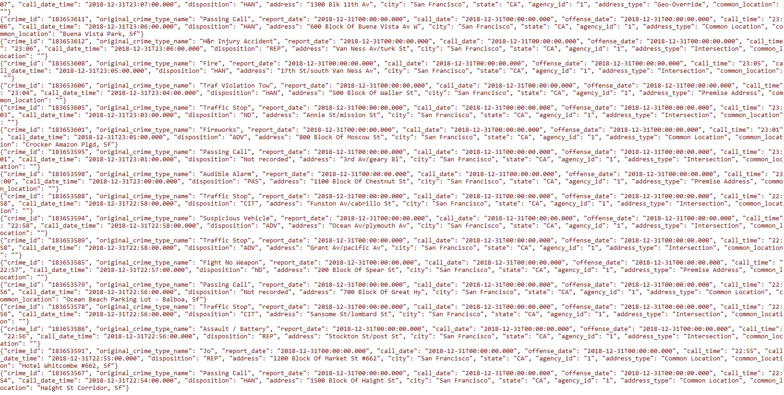
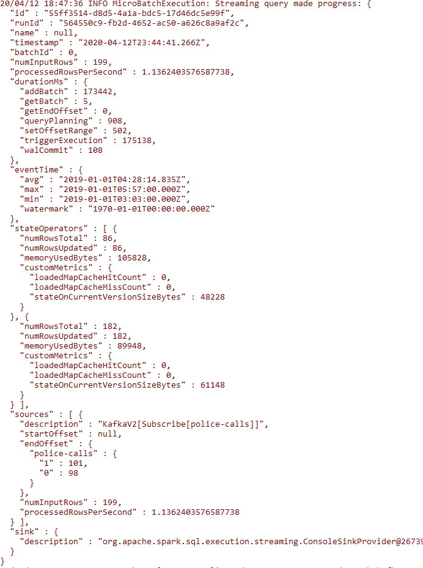
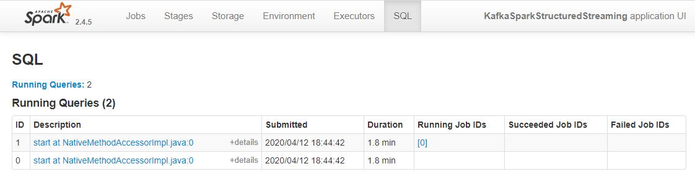

### SF Crime Statistics with Spark Streaming

## Step 1
The first step is to build a simple Kafka server.
Complete the code for the server in producer_server.py and kafka_server.py.
Local Environment
To see if you correctly implemented the server, use the command bin/kafka-console-consumer.sh --bootstrap-server localhost:<your-port-number> --topic <your-topic-name> --from-beginning to see your output.

## Step 2
Apache Spark already has an integration with Kafka brokers, so we would not normally need a separate Kafka consumer. However, we are going to ask you to create one anyway. Why? We'd like you to create the consumer to demonstrate your understanding of creating a complete Kafka Module (producer and consumer) from scratch. In production, you might have to create a dummy producer or consumer to just test out your theory and this will be great practice for that.
Implement all the TODO items in data_stream.py. You may need to explore the dataset beforehand using a Jupyter Notebook.
Do a spark-submit using this command: spark-submit --packages org.apache.spark:spark-sql-kafka-0-10_2.11:2.3.4 --master local[*] data_stream.py.
Take a screenshot of your progress reporter after executing a Spark job. You will need to include this screenshot as part of your project submission.

Take a screenshot of the Spark Streaming UI as the streaming continues. You will need to include this screenshot as part of your project submission.

## Step 3

How did changing values on the SparkSession property parameters affect the throughput and latency of the data?
Ans: It changes the processedRowsPerSecond

What were the 2-3 most efficient SparkSession property key/value pairs? Through testing multiple variations on values, how can you tell these were the most optimal?

 I used processedRowsPerSecond as the target value to optimize.
I found 
spark.sql.shuffle.partitions                10
spark.streaming.kafka.maxRatePerPartition   10
spark.default.parallelism                   10000

